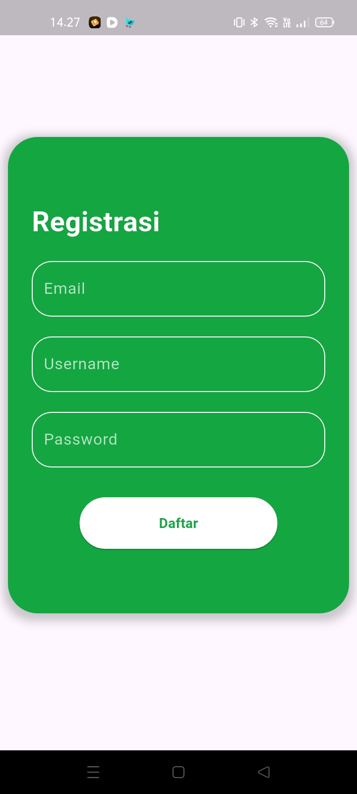

<!DOCTYPE html>
<html lang="id" class="scroll-smooth">
<head>
    <meta charset="UTF-8">
    <meta name="viewport" content="width=device-width, initial-scale=1.0">
    <title>Aplikasi Inventaris CRUD dengan Flutter & SQLite</title>
    
    <link rel="preconnect" href="https://fonts.googleapis.com">
    <link rel="preconnect" href="https://fonts.gstatic.com" crossorigin>
    <link href="https://fonts.googleapis.com/css2?family=Inter:wght@400;500;600;700&display=swap" rel="stylesheet">
    <!-- Chosen Palette: Cool Slate (Light slate background, dark slate text, indigo accents) -->
    <!-- Application Structure Plan: A single-page, vertically scrolling application with distinct thematic sections (Hero, Features, Screenshots, Tech Stack, Getting Started, Contribute). This structure is more engaging and scannable than a linear README. Key interactions include smooth scrolling navigation, a tabbed interface for setup instructions, and copy-to-clipboard buttons for code blocks to improve user experience. -->
    <!-- Visualization & Content Choices: Report Info: Project features -> Goal: Compare/Inform -> Presentation: Icon-based grid of cards -> Interaction: None -> Justification: More visually appealing and easier to digest than a bullet list. Report Info: Tech stack -> Goal: Inform -> Presentation: Styled badges in a grid -> Interaction: None -> Justification: Better visual grouping than a list. Report Info: Setup instructions -> Goal: Organize/Instruct -> Presentation: Tabbed interface with copyable code blocks -> Interaction: Tab switching, copy button -> Justification: Organizes complex steps, reduces cognitive load, and makes commands easy to use. -->
    <!-- CONFIRMATION: NO SVG graphics used. NO Mermaid JS used. -->
    
</head>
<body class="bg-slate-50 text-slate-800">

    <!-- Header & Navigasi -->
    <header class="bg-white/80 backdrop-blur-lg sticky top-0 z-50 border-b border-slate-200">
        <nav class="max-w-6xl mx-auto px-4 sm:px-6 lg:px-8">
            

                

                    📦 Inventaris App
                

                

                    <a href="#fitur" class="text-slate-600 hover:text-indigo-600 transition">Fitur</a>
                    <a href="#teknologi" class="text-slate-600 hover:text-indigo-600 transition">Teknologi</a>
                    <a href="#memulai" class="text-slate-600 hover:text-indigo-600 transition">Memulai</a>
                

            

        </nav>
    </header>

    <main class="max-w-6xl mx-auto px-4 sm:px-6 lg:px-8 py-12 sm:py-16">

        <!-- Hero Section -->
        <section class="text-center mb-20">
            <h1 class="text-4xl sm:text-5xl md:text-6xl font-extrabold tracking-tight text-slate-900 mb-4">
                Simple Inventory CRUD App
            </h1>
            

                Aplikasi inventaris sederhana dibangun dengan Flutter dan SQLite. Kelola daftar barang Anda dengan mudah, termasuk tambah, lihat, edit, hapus, dan unggah gambar.
            

            

                <a href="#memulai" class="w-full sm:w-auto bg-indigo-600 text-white font-semibold py-3 px-8 rounded-lg shadow-md hover:bg-indigo-700 transition transform hover:scale-105">
                    Panduan Memulai
                </a>
                <a href="https://github.com/nama-pengguna-anda/nama-repo-anda" target="_blank" class="w-full sm:w-auto bg-slate-200 text-slate-700 font-semibold py-3 px-8 rounded-lg hover:bg-slate-300 transition">
                    Lihat di GitHub
                </a>
            

        </section>

        <!-- Fitur Utama -->
        <section id="fitur" class="mb-20 scroll-mt-20">
            

                <h2 class="text-3xl font-bold tracking-tight text-slate-900">✨ Fitur Utama</h2>
                
Semua yang Anda butuhkan untuk manajemen inventaris dasar.

            

            

                

                    <h3 class="text-lg font-semibold mb-2">Tambah Barang Baru</h3>
                    
Masukkan nama barang, harga, dan tambahkan gambar dari galeri atau kamera Anda.

                

                

                    <h3 class="text-lg font-semibold mb-2">Lihat & Edit Barang</h3>
                    
Tampilkan semua item dalam daftar yang mudah diakses dan perbarui detailnya kapan saja.

                

                

                    <h3 class="text-lg font-semibold mb-2">Hapus & Simpan Lokal</h3>
                    
Hapus item yang tidak lagi diperlukan. Semua data disimpan dengan aman di perangkat menggunakan SQLite.

                

            

        </section>

        <!-- Tampilan Aplikasi -->
        <section id="tampilan" class="mb-20 text-center">
             

                <h2 class="text-3xl font-bold tracking-tight text-slate-900">📸 Tampilan Aplikasi</h2>
                
Beginilah tampilan aplikasi Anda saat beraksi.

            

            

                
            

             
Catatan: Ganti placeholder di atas dengan screenshot nyata dari aplikasi Anda.

        </section>

        <!-- Teknologi yang Digunakan -->
        <section id="teknologi" class="mb-20 scroll-mt-20">
            

                <h2 class="text-3xl font-bold tracking-tight text-slate-900">🛠️ Teknologi yang Digunakan</h2>
                
Dibangun dengan teknologi modern dan andal.

            

            

                Flutter
                Dart
                SQLite
                sqflite
                image_picker
                path_provider
                google_fonts
                shared_preferences
                local_auth
                path
                url_launcher
                flutter_svg
                flutter_localization
            

        </section>

        <!-- Memulai Proyek -->
        <section id="memulai" class="mb-20 scroll-mt-20">
            

                <h2 class="text-3xl font-bold tracking-tight text-slate-900">🚀 Memulai Proyek</h2>
                
Ikuti langkah-langkah ini untuk menjalankan proyek di mesin lokal Anda.

            

            

                <!-- Tab Buttons -->
                

                    <nav class="-mb-px flex space-x-6" aria-label="Tabs">
                        <button class="tab-button active" data-tab="prasyarat">Prasyarat</button>
                        <button class="tab-button" data-tab="instalasi">Instalasi</button>
                        <button class="tab-button" data-tab="jalankan">Jalankan</button>
                    </nav>
                

                <!-- Tab Content -->
                

                    

                        <h3 class="font-semibold text-lg mb-4">Prasyarat Sistem</h3>
                        
Pastikan Anda telah menginstal perangkat lunak berikut di sistem Anda:

                        <ul class="list-disc list-inside space-y-2 text-slate-600">
                            <li><a href="https://docs.flutter.dev/get-started/install" target="_blank" class="text-indigo-600 hover:underline">Flutter SDK</a> (versi stabil terbaru direkomendasikan)</li>
                            <li><a href="https://dart.dev/get-started" target="_blank" class="text-indigo-600 hover:underline">Dart SDK</a> (biasanya sudah termasuk dengan Flutter)</li>
                        </ul>
                    

                    

                        <h3 class="font-semibold text-lg mb-4">Langkah-langkah Instalasi</h3>
                        

                            

                                
1. Clone repository ini:

                                

                                    <pre class="bg-slate-800 text-white p-4 rounded-lg text-sm overflow-x-auto"><code id="code-clone">git clone https://github.com/nama-pengguna-anda/nama-repo-anda.git

cd nama-repo-anda</code></pre>
<button class="copy-button" onclick="copyCode('code-clone', this)">Salin</button>

2. Dapatkan semua dependensi:

<pre class="bg-slate-800 text-white p-4 rounded-lg text-sm overflow-x-auto"><code id="code-pub-get">flutter pub get</code></pre>
<button class="copy-button" onclick="copyCode('code-pub-get', this)">Salin</button>

3. (Opsional) Tambahkan dependensi jika belum ada:

<pre class="bg-slate-800 text-white p-4 rounded-lg text-sm overflow-x-auto"><code id="code-pub-add">flutter pub add google_fonts sqflite shared_preferences local_auth path url_launcher image_picker flutter_svg flutter_localization</code></pre>
<button class="copy-button" onclick="copyCode('code-pub-add', this)">Salin</button>

<h3 class="font-semibold text-lg mb-4">Menjalankan Aplikasi</h3>

Gunakan perintah berikut untuk menjalankan aplikasi pada emulator atau perangkat fisik yang terhubung.

<pre class="bg-slate-800 text-white p-4 rounded-lg text-sm overflow-x-auto"><code id="code-run">flutter run</code></pre>
<button class="copy-button" onclick="copyCode('code-run', this)">Salin</button>

</section>

        <!-- Kontribusi & Lisensi -->
        <section class="text-center border-t border-slate-200 pt-12">
            <h2 class="text-2xl font-bold tracking-tight text-slate-900">🤝 Kontribusi & Lisensi</h2>
            

                Kontribusi disambut baik! Silakan Fork, buat branch, dan kirim Pull Request. Proyek ini dilisensikan di bawah Lisensi MIT.
            

        </section>

    </main>

    <footer class="text-center py-8 text-sm text-slate-500">
        
&copy; 2024 Simple Inventory CRUD App. Dibangun dengan Flutter.

    </footer>

    

</body>
</html>
